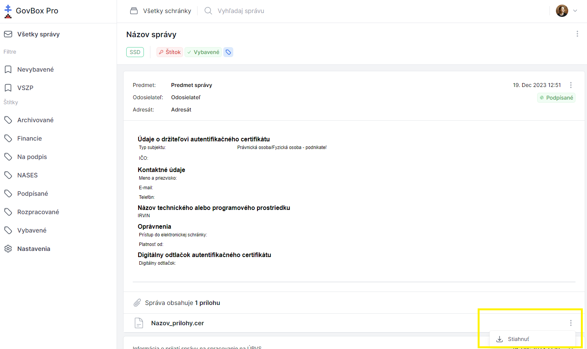

# Stiahnutie prílohy

Pri každej pripojenej prílohe v správe sa nachádza ikona troch bodiek.

## Postup stiahnutia

1. **Nájdite prílohu**
   Pri každej pripojenej prílohe sa nachádza ikona troch bodiek

2. **Otvorte menu**
   Kliknite na ikonu troch bodiek pri prílohe

3. **Stiahnite súbor**
   V rozbaľovacom menu vyberte možnosť stiahnutia

::: callout info "Poznámka"
Stiahnuté prílohy sa štandardne ukladajú do priečinka pre stiahnuté súbory vo vašom prehliadači.
:::
