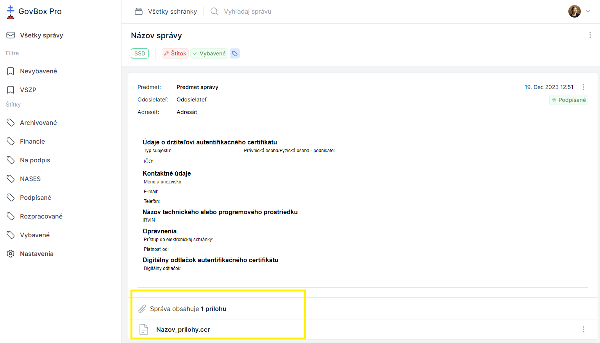

# Zobrazenie prílohy

Po kliknutí na konkrétne vlákno sa zobrazí obsah správy.

## Zobrazenie prílohy

1. **Otvorte správu**
   Kliknite na vlákno pre zobrazenie jeho obsahu

2. **Nájdite informáciu o prílohách**
   Pokiaľ je k správe pripojená príloha, pod obsahom správy sa zobrazí informácia s počtom príloh

3. **Zobrazte prílohu**
   Po kliknutí na názov prílohy sa v novom okne zobrazí obsah pripojenej prílohy

::: callout tip "Podporované formáty"
Prílohy sa zobrazujú priamo v prehliadači, ak je daný formát podporovaný. V opačnom prípade si ich môžete stiahnuť do počítača.
:::
