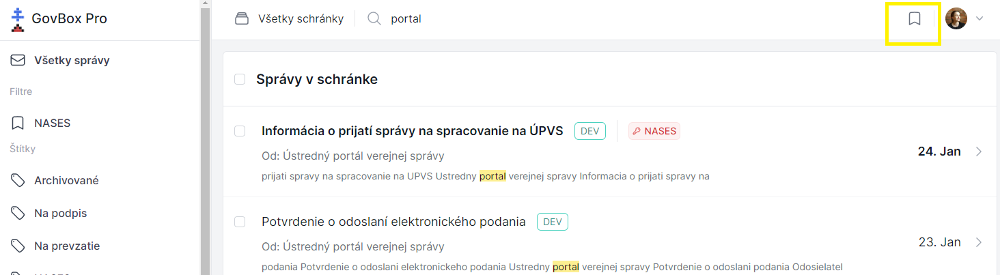
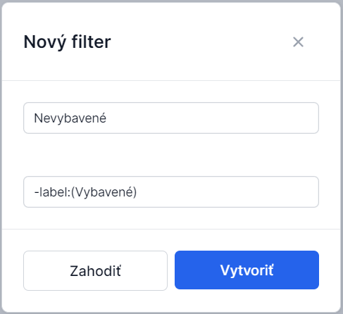

# Vytvorenie vlastného filtra

Filter je dopyt vyhľadávania uložený spoločne s názvom na neskoršie využitie.

::: callout tip "Praktický príklad"
> **Vytvorím filter "Nevybavené", kde sa budem dopytovať na všetky správy, ktoré nemajú štítok "Vybavené". Zobrazenie tohto filtra zabezpeční prehľad agendy, ktorá vyžaduje riešenie či odpoveď.**
> 
> Dopyt: `-label:(Vybavené)`
:::

## Spôsob vytvorenia filtra

::: tabs

== tab "Z poľa vyhľadávania"

1. **Zadajte dopyt**
   Filter nastavíte priamo po zadaní dopytu do poľa vo vrchnej časti obrazovky

2. **Vyhľadajte správy**
   Po vyhľadaní správ máte k dispozícii v pravej časti obrazovky ikonu filtra

3. **Uložte filter**
   Kliknutím na ikonu filtra ponúka možnosť uloženia dopytu vo forme filtra

4. **Vytvorte filter**
   V pravom hornom rohu sa nachádza modré tlačidlo **"Vytvoriť filter"**

5. **Vyplňte údaje**
   V okne **"Nový filter"**:
   - Pole pre **názov** filtra
   - Pole pre **dopyt** na vyhľadávanie
   - Tlačidlo **"Zahodiť"**
   - Tlačidlo **"Vytvoriť"**

6. **Použite operátor negácie**
   Dopyt na negáciu môžete zadať použitím **mínus** (napr. `-label:(Vybavené)`)

== tab "Z bočného menu"

1. **Otvorte nastavenia**
   V ľavom bočnom menu sa nachádzajú filtre, štítky a ikona pre nastavenie
   Kliknite na nastavenie

2. **Otvorte filtre**
   Zobrazí sa okno s názvom **"Filtre"**

3. **Vytvorte nový filter**
   V pravom rohu kliknite na **"Vytvoriť filter"**

4. **Zadajte údaje**
   Zadajte názov a dopyt na vyhľadávanie

:::

## Operátory pre vyhľadávanie

| Operátor | Popis | Príklad |
|----------|-------|---------|
| `label:(Názov)` | Vyhľadanie vlákien so štítkom | `label:(Test)` |
| `-label:(Názov)` | Vyhľadanie vlákien bez štítku | `-label:(Test)` |
| `-label:(*)` | Vyhľadanie vlákien úplne bez štítkov | `-label:(*)` |

## Súvisiace témy

### Notifikácie
Nastavte si upozornenia na správy vyhovujúce filtrom.

- **[Nastavenie notifikácií](/notifications/setting-up)**

### Filter (pojem)
Čo je filter a ako funguje.

- **[Filter (pojem)](/concepts/filter)**

