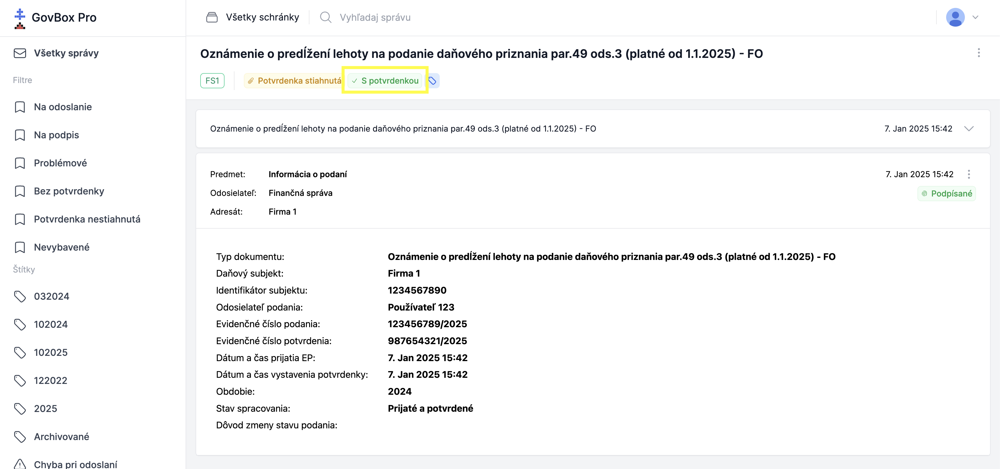

# Kontrola potvrdení z Finančnej správy
V GovBox PRO je možné efektívne kontrolovať či ku každému podaniu bolo doručené potvrdenie z Finančnej správy a je v požadovanom stave. 

## Postup kontroly potvrdení z Finančnej správy
1. **Automatické označenie podaní s potvdenkou štítkom**
   GovBox PRO automaticky po doručení potvrdenky kontroluje jej stav spracovania a overenie podpisov, a pokiaľ je potvrdenka v poriadku, označí dané podanie štítkom **"S potvrdenkou"**

   

3. **Identifikácia podaní s problémom týkajúcim sa potvrdenky**
   Vďaka filtru **Bez potvrdenky** rýchlo identifikujete, ktoré podania nemajú potvrdenku alebo potvrdenka nie je v požadovanom stave. Nemusíte tak kontrolovať každé podanie jednotlivo, ale jednoducho si zobrazíte len tie, ktoré potrebujú ďalšiu pozornosť

## Súvisiace témy

### Hromadné podania
Ako hromadne podávať na Finančnú správu v GovBox PRO:

- **[Hromadné podania](../signing/submissions.md)**

### Filtre
Ako fungujú filtre v GovBox PRO:

- **[Filtre](../concepts/filter.md)**

### Hromadný export správ
Export podaní a potvrdení z GovBox PRO:

- **[Hromadný export](../messages/export.md)**