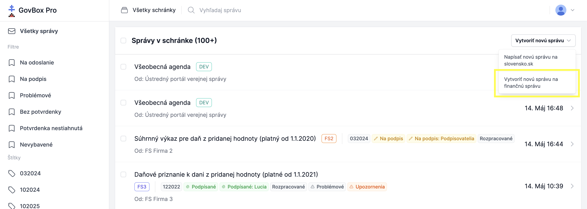
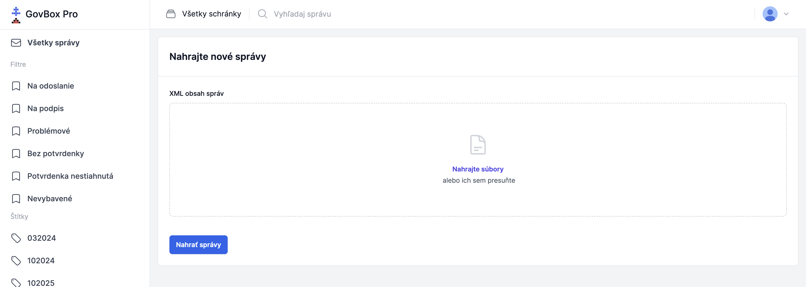

# Hromadné podania na Finančnú správu
V GovBox PRO je možné vytvárať podania na Finančnú správu, ktoré sa automaticky validujú, následne ich podpíšete a odošlete na Finančnú správu. Podania sa vytvárajú z XML súborov.

## Postup hromadného podávania na Finančnú správu
1. **Vytvorte nové správy**
   Používateľ v prehľade vlákien správ klikne vpravo hore na tlačidlo **Vytvoriť novú správu na finančnú správu**

   

2. **Vyberte XML súbory**
   Naraz používateľ nahrá všetky pripravené XML súbory, ktoré sa môžu týkať rôznych klientov, rôzne typy podaní

   

3. **Nahrajte správy**
   Klikne na tlačidlo **"Nahrať správy"**

4. **Validácia podaní**
   Automaticky sa **skontroluje** obsah podaní **rovnakou logikou ako na portáli Finančnej správy** a podania s validačnými chybami sa označia za problémové, aby používateľ jednoducho vedel určiť, ktoré podania treba skontrolovať

5. **Kontrola problémových podaní**
   Pomocou štíkta Problémové rýchlo identifikujete, ktoré podania je potrebné skontrolovať

6. **Hromadné podpísanie podaní**
   Označíte si podania, ktoré chcete podpísať a zadaním bezpečnostných kódov iba jedenkrát podpíšete všetky naraz, viď [Hromadné podpisovanie](../signing/bulk-signing.md)

7. **Odoslanie podaní**
   Podania môžete odoslať hromadne, viď [Odosielanie správ](../messages/submitting.md)

8. **Evidencia potvrdení**
   Po spracovaní podaní uvidíte v GovBox PRO údaje o každom spracovanom podaní, potvrdenku a ďalšie súvisiace správy, ktoré sa automaticky načítajú do správnych vlákien. Vďaka tomu máte všetko prehľadne pohromade a nemusíte manuálne párovať podania s potvrdenkami

## Súvisiace témy

### Hromadné podpisovanie dokumentov
Ako hromadne podpisovať dokumenty v GovBox PRO:

- **[Hromadné podpisovanie](../signing/bulk-signing.md)**

### Odosielanie správ
Ako odoslať rozpracované správy v GovBox PRO:

- **[Odosielanie správ](../messages/submitting.md)**

### Kontrola potvrdení
Ako efektívne kontrolovať potvrdenia k podaniam v GovBox PRO:

- **[Kontrola potvrdení](../signing/bulk-signing.md)**

### Hromadný export správ
Export podaní a potvrdení z GovBox PRO:

- **[Hromadný export](../messages/export.md)**