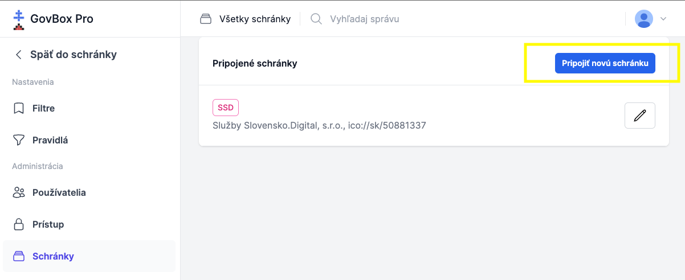

# Správa schránok

Administrátor môže do aplikácie pridať ďalšie elektronické schránky.

::: callout warning "Predpoklady"
Pridať je možné iba také schránky, na ktoré má tenant oprávnenie na zastupovanie.
:::

## Zistenie oprávnení na slovensko.sk

1. **Prihláste sa do el. schránky tenanta**
   Prejdite na [zoznam identít na slovensko.sk](https://www.slovensko.sk/sk/moj-profil/zobrazenie-zastupovania)

2. **Vyhľadajte sekciu "Zastupovanie"**
   Kliknite na uvedený link, alebo po prihlásení prejdite do sekcie **"Profil"** a následne do sekcie **"Zobrazenie zastupovania"**

3. **Zistite oprávnenia**
   Podľa sekcie **"Ste oprávnený zastupovať nasledovné identity"** zistíte, ktoré schránky môžete pridať

## Postup pridania schránky v GovBox PRO

1. **Otvorte Nastavenia**
   Administrátor klikne v ľavom bočnom menu na **"Nastavenia"**

2. **Prejdite do sekcie Administrácia**
   V sekcii **"Administrácia"**, klikne na možnosť **"Schránky"**

3. **Kliknite na pripojenie novej schránky**
   Administrátor klikne na tlačidlo **"Pripojiť novú schránku"** vpravo hore

4. **Vyplňte údaje o el. schránke**
   - **Názov** el. schránky
   - **URI** - skopírujte z [zoznamu](https://www.slovensko.sk/sk/moj-profil/zobrazenie-zastupovania) na portáli slovensko.sk
   - **ID identity** - skopírujte z [zoznamu](https://www.slovensko.sk/sk/moj-profil/zobrazenie-zastupovania) na portáli slovensko.sk
   - **Skrátený názov** schránky
   - **Farba štítka** pre danú schránku

5. **Vytvorte schránku**
   Administrátor klikne na tlačidlo **"Vytvoriť"**

### Schránky v nastaveniach

### Formulár pripojenia schránky

::: callout info "Poznámka"
Ak by ste v časti **"Nastavenia"** → **"Schránky"** nevideli tlačidlo **"Pripojiť novú schránku"**, je potrebné nastaviť iný typ pripojenia schránok. V takom prípade kontaktujte administrátora.
:::
