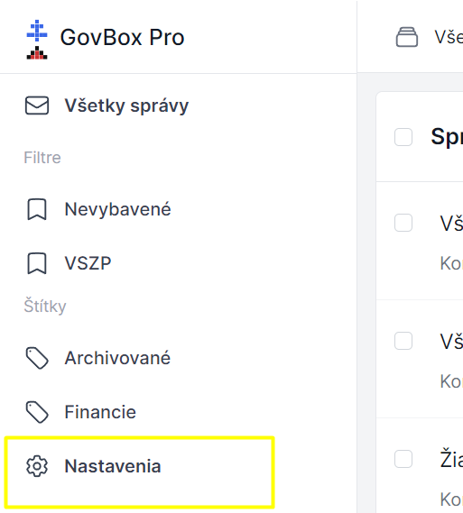
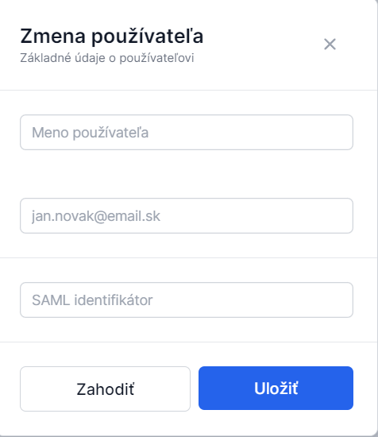

# Správa používateľov

Administrátor môže udeliť prístup do aplikácie ďalším používateľom alebo upraviť ich prihlasovacie údaje.

1. **Otvorte Nastavenia**
   Administrátor klikne v ľavom bočnom menu na **"Nastavenia"**

2. **Prejdite do sekcie Administrácia**
   V sekcii **"Administrácia"**, klikne na možnosť **"Používatelia"**

3. **Vytvorte nového používateľa** alebo upravte existujúceho
   Administrátor klikne na tlačidlo **"Vytvoriť používateľa"** v pravom hornom rohu alebo klikne na ikonu ceruzky pri existujúcom používateľovi, ktorého chce upraviť

4. **Vyplňte údaje**
   Zadajte základné údaje o používateľovi

### Používatelia v nastaveniach

### Formulár používateľa

::: callout info "SAML identifikátor"
SAML identifikátor slúži na prihlasovanie cez slovensko.sk a **nie je povinný**.
:::

## Prístup k správam

Novému používateľovi je možné udeliť plný alebo čiastočný prístup k správam. Ku ktorým správam bude mať používateľ prístup je možné ovplyvniť pomocou:

### Spôsoby prístupu
- **Štítkov** - umožňujú filtrovať prístup podľa kategórie správ
- **Schránok** - umožňuje udeliť používateľovi prístup iba k vybraných schránkam
- **Skupín** - umožňujú zdieľať prístup medzi viacerými používateľmi

::: callout tip
Podľa potreby administrátor priradí nového používateľa do skupín.
:::
