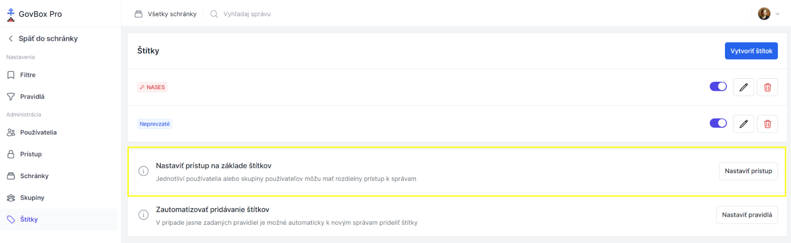
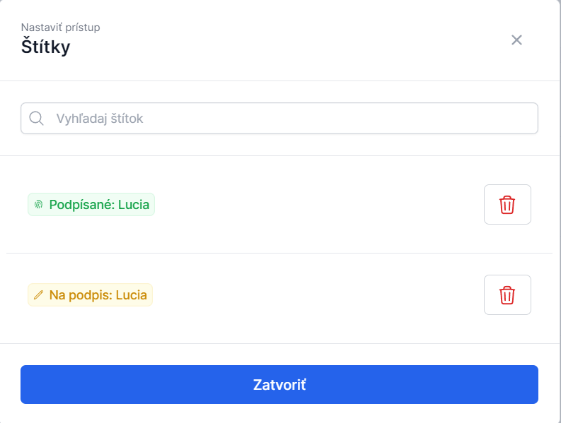

# Prístup k štítkom

Prístup k štítkom umožňuje administrátorom kontrolovať, ktorí používatelia alebo skupiny majú prístup k vláknam označeným konkrétnym štítkom.

::: callout info "Výhody"
Toto je ideálny spôsob, ako zabezpečiť, že napríklad zamestnanci účtovného oddelenia budú vidieť len správy týkajúce sa financií.
:::

## Postup nastavenia prístupu

1. **Otvorte Nastavenia**
   Kliknite na **"Nastavenia"** v ľavom menu dole

2. **Prejdite do sekcie Štítky**
   V sekcii **"Administrácia"** kliknite na možnosť **"Štítky"**

3. **Zobrazí sa prehľad štítkov**
   Zobrazia sa vytvorené štítky a sekcia **"Nastaviť prístup na základe štítkov"**

4. **Nastavte prístup**
   Kliknite na **"Nastaviť prístup"** v príslušnom riadku

5. **Upravte oprávnenia skupiny**
   V nastaveniach sa riadi príslušnosť k skupinám
   Kliknutím na ikonu pera v danom riadku skupiny máte možnosť skupine pridať alebo odobrať prístup k štítku

## Príklady použitia

### Príklad: Sociálna poisťovňa
> Vytvorím štítok **"Sociálna poisťovňa"** s pravidlom, že správy prichádzajúce a odchádzajúce do Sociálnej poisťovne budú takto označované. Ekonomickému oddeleniu vo firme udelím prístup na zobrazenie správ s týmto štítkom. Iné správy osobám s týmto oprávnením zobrazené nebudú.

### Príklad: Prístup k financiám
> Ekonomickému oddeleniu udelím prístup k správam so štítkom **"Financie"**.

## Súvisiace témy

### Vytvorenie štítka
Ako vytvoriť nový štítok.

- **[Vytvorenie štítka](/labels/creating)**

### Správa skupín
Vytváranie a správa skupín používateľov.

- **[Správa skupín](/getting-started/group-management)**

