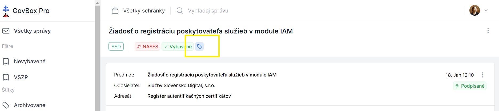
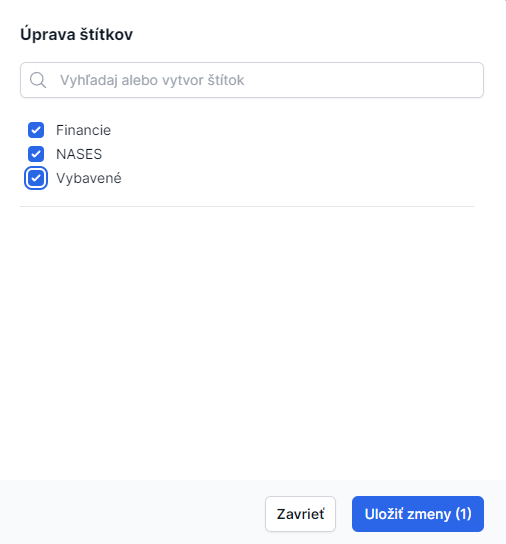

# Vytvorenie štítka a označenie vlákna

::: callout tip "Praktický príklad"
> **Vytvorím štítok "Vybavené". Týmto štítkom budem označovať vlákna, ktoré už sú vybavené a nevyžadujú ďalej moju pozornosť.**
:::

## Postup vytvorenia štítka

1. **Otvorte vlákno**
   Kliknite na konkrétne vlákno pre zobrazenie jeho obsahu

2. **Nájdite ikonu štítkov**
   Pod názvom vlákna sa nachádza modrá ikona pre priradenie štítku

3. **Kliknite na ikonu**
   Kliknite na modrú ikonu

4. **Vytvorte nový štítok**
   Zobrazí sa okno s názvom **"Úprava štítkov"**
   - Napíšte názov nového štítku do poľa
   - Zaškrtnutím poľa potvrďte jeho vytvorenie

5. **Priradte štítok k vláknu**
   - Označte vlákno ľubovoľným štítkom
   - Kliknite na **"Uložiť zmeny"**

::: callout success "Hotovo!"
Po týchto krokoch sa vybraný štítok zobrazí pri konkrétnom vlákne.
:::
