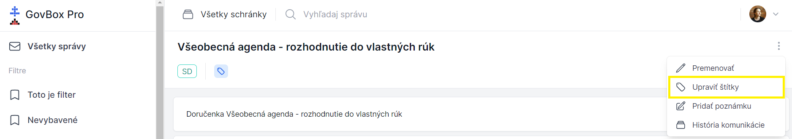

# Úprava štítkov

## Postup úpravy štítkov

1. **Otvorte menu vlákna**
   Pri zobrazení konkrétneho vlákna sa v pravom hornom rohu nachádza ikona s troma bodkami

2. **Kliknite na ikonu**
   Kliknite na ikonu s troma bodkami

3. **Zvoľte úpravu štítkov**
   V rozbaľovacom menu vyberte možnosť **"Upraviť štítky"**

4. **Upravte štítky**
   Zobrazí sa nové okno pre úpravu štítkov, kde je možné:
   - **Označiť** štítky pre pridanie k vláknu
   - **Odznačiť** štítky pre odobratie z vlákna
   - **Vyhľadať** štítok

5. **Uložte zmeny**
   Kliknite na modré tlačidlo **"Uložiť zmeny"**

6. **Overte úspech**
   V pravom hornom rohu obrazovky sa objaví zelené okno s informáciou o úspešnom pridaní/odobratí štítku
   Zmeny sa prejavia aj pod názvom vlákna v sekcii **"Štítky"**

::: callout success "Hotovo!"
Štítky boli úspešne pridané alebo odobraté z vlákna.
:::

## Súvisiace témy

### Vytvorenie štítka
Ako vytvoriť nový štítok.

- **[Vytvorenie štítka](/labels/creating)**

### Prístup k štítkom
Nastavenie oprávnení pre prístup k štítkom.

- **[Prístup k štítkom](/labels/access-control)**

