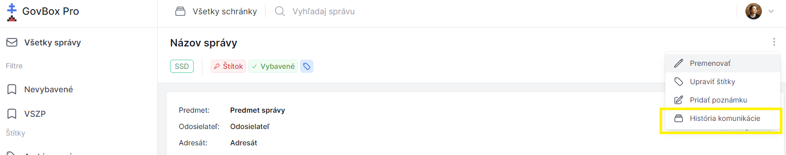
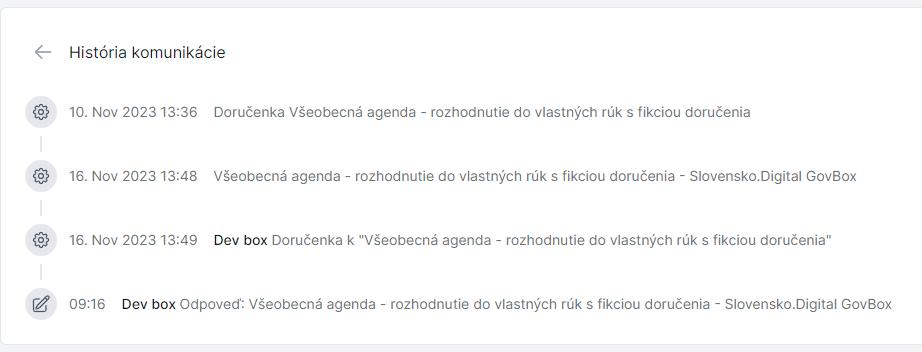

# História komunikácie vlákna

Pri zobrazení konkrétnej správy sa pri názve správy v pravom rohu nachádza ikona s troma bodkami.

## Zobrazenie histórie komunikácie

1. **Otvorte menu správy**
   Kliknite na ikonu s troma bodkami pri názve správy

2. **Zvoľte históriu komunikácie**
   V rozbaľovacom menu vyberte možnosť **"História komunikácie"**

3. **Zobrazí sa história**
   Po kliknutí sa pod názvom vlákna zobrazí nové okno s históriou komunikácie

## Využitie histórie komunikácie

### Výhody histórie
História komunikácie umožňuje:

- Prehľad všetkých správ v rámci vlákna
- Sledovanie chronologického priebehu komunikácie
- Orientáciu v dlhších vláknach

::: callout tip
História komunikácie je užitočná najmä pri dlhších vláknach s množstvom správ, kde potrebujete rýchlo nájsť konkrétnu informáciu.
:::
