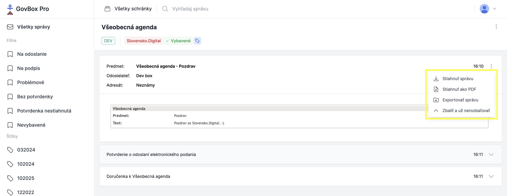
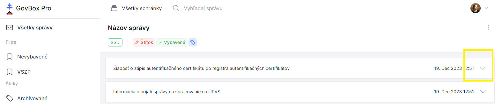

# Stiahnutie správy

Pri zobrazení konkrétnej správy sa pri predmete v pravom rohu nachádza ikona s troma bodkami.

## Postup stiahnutia

1. **Otvorte menu správy**
   Kliknite na ikonu s troma bodkami pri predmete správy

2. **Stiahnite správu**
   V rozbaľovacom menu vyberte možnosť stiahnutia správy

::: callout warning "Poznámka"
Takto stiahnutá správa je určená skôr pre technikov pre účely analýzy chýb ako bežných používateľov.
:::

## Zobrazenie zbalenej správy

1. **Nájdite zbalenú správu**
   Niektoré správy (nepodstatné) môžu byť automaticky zbalené

2. **Zobrazte celý obsah**
   Kliknite na ikonu šípky nadol
   Zobrazí sa celý obsah správy

::: callout tip "Tip"
Zbalené správy sú zvyčajne automaticky označené ako menej dôležité. Ak ich potrebujete vidieť, stačí kliknúť na šípku.
:::
