# Hromadný export správ
Správy je možné z GovBox PRO hromadne **exportovať**.

## Postup hromadného exportu

1. **Otvorte správy na exportovanie**
   Používateľ otvorí zoznam správ, ktoré chce exportovať, buď cez tlačidlo "Všetky správy" alebo cez niektorý z filtrov, resp. štítkov

2. **Označte správy**
   Zaškrtnutím označí správy, ktoré chce exportovať

3. **Vyberte hromadnú akciu**
   Klikne na tlačidlo **"Hromadné akcie"** a zvolí možnosť **"Exportovať"**

   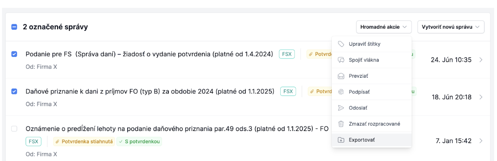

4. **Nastavte export**
   Po otvorení okna s nastaveniami exportu si zvolíte, čo chcete exportovať:
      - sumár alebo iba samotné správy
      - dokumenty aj v PDF formáte
      - všetky správy z vybraných vlákien alebo iba určitý typ formulára (platí pre FS podania) alebo typy správ, ktoré sa majú exportovať (napr. iba potvrdenky)

   Môžete si určiť formát názvov výsledných súborov a priečinkov. Napríklad pre podania a potvrdenky je možné nastaviť odlišný formát.

    Ak chcete exportovať potvrdenky, aj odoslané podania a Váš želaný formát pomenovania by bol povedzme:
    - pre podania napr. Firma XY/Firma XY_SVDPH_092025
     - pre potvrdenky napr. : Firma XY/Firma XY_SVDPH_092025_potvrdenie

    Je potrebné, aby ste zvolili nasledovné nastavenia:
    - Exportovať správy
     - Exportovať aj PDF
     - Všetky správy
       - vyplniť želaný formát (napr. podľa ukážky nižšie)
     - ED.DeliveryReport (to je označenie pre potvrdenku)
       - pri potvrdenke vyplniť želaný formát (napr. podľa ukážky nižšie)

    Všetky možnosti, aké premenné sa dajú použiť uvidíte v GovBox PRO

    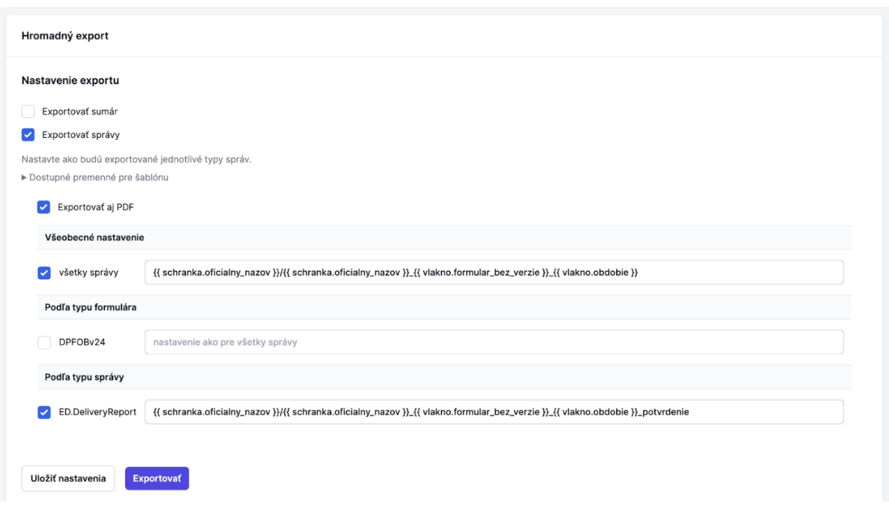

5. **Uložte nastavenia a spustite export**
   Používateľ uloži nastavenia a stlačí tlačidlo "Exportovať". Export sa začne vytvárať a v závislosti od počtu správ a zvolených nastavení môže chvíľu trvať

6. **Stiahnite si export**
   Po dokončení spracovania Vás systém upozorní. Link na stiahnutie nájdete vo Vašich Notifikáciách. Odkaz na notifikácie nájdete v pravom hornom rohu po kliknutí na používateľa

   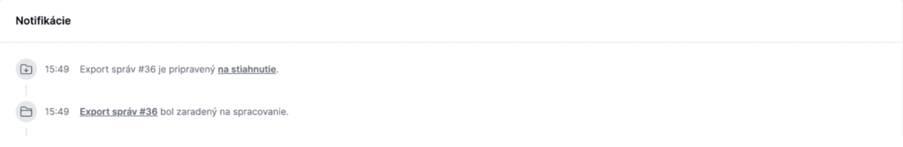

::: callout tip "Tip"
Ak ZIP súbor obsahuje rovnakú štruktúru priečinkov ako cieľový adresár, po rozbalení sa súbory automaticky uložia do existujúcich priečinkov s rovnakými názvami.
:::

## Obsah exportu
Export môže obsahovať sumár správ, dokumenty v originálnom formáte a PDF vizualizácie dokumentov z vybraných správ

### Sumár
Sumár je excel dokument (formát .xlsx) so zoznamom všetkých správ v exportovaných vláknach. Slúži ako prehľad toho, koľko akých správ bolo do elektronických schránok doručených, resp. z nich odoslaných. Sumár obsahuje ku každej exportovanej správe základné údaje ako je DIČ alebo IČO a názov daného subjektu, kedy bola daná správa doručená, identifikátory danej správy, jej stav, typ, štítky, ktorými bola správa v GovBox PRO označená, atď.

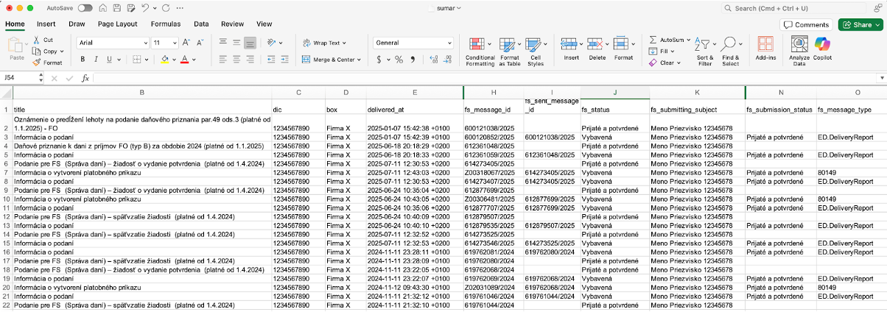

Vďaka tomu, že sa jedná o tabuľku je možné s ňou jednoducho ďalej pracovať, filtrovať potrebné údaje, skryť nepotrebné stĺpce a mnoho iného podľa vlastných potrieb.

### PDF vizualizácie dokumentov
Ak chcete mať dokumenty lepšie čitateľné alebo pripravené na tlač, môžete ich pri exporte automaticky previesť do formátu PDF. GovBox PRO k vybraným dokumentom vytvorí aj PDF verziu, ktorá je vhodná na čítanie a tlač. Táto PDF verzia neobsahuje elektronické podpisy.

### Originálne dokumenty
Export vždy obsahuje dokumenty zo zvolených správ v originálnom formáte, väčšinou v ASiC-E formáte, ktoré obsahujú aj podpisy odosielateľov a sú právne záväzné.

## Štruktúra exportu
Štruktúru exportu a spôsob pomenovania súborov i priečinkov máte plne vo svojej réžii. V nastaveniach exportu uvediete štruktúru, v ktorej môžete použiť premenné. Pri každej správe tieto premenné budú nahradené hodnotou, kt. zodpovedá danej správe. Zoznam podporovaných premenných si môžete pozrieť v nastaveniach exportu.
V šablóne môžete používať premenné, ale aj priamo hodnoty, napr. pevne stanoviť, že potvrdenia budú vždy pomenované ako potvrdenia.
Lomka / funguje ako „vstup do ďalšieho priečinka“. Čím viac lomiek použijete, tým hlbšie budú súbory uložené. Príklad:
`{{ schranka.oficialny_nazov }}/Dokumenty/{{ vlakno.obdobie }}/potvrdenie`
znamená, že súbor s názvom potvrdenie bude uložený v priečinku podľa obdobia podania, ktorý je v priečinku Dokumenty a ten je uložený v priečinku s oficiálnym názvom schránky.

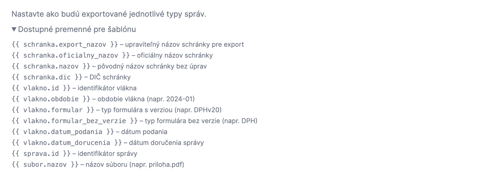

### Príklady nastavenia šablóny
#### Príklad 1 FS agenda
Export podaní s originál názvom súboru a export potvrdení so špeciálnym pomenovaním, ak požadujete, aby:

* dokumenty boli uložené v priečinku s názvom daného subjektu, kt. sa týka,
* v názve každého súboru bolo uvedené, o aký typ podania sa jedná,
* odoslané podania boli uložené s originál názvom súboru,
* potvrdenia boli pomenované ako potvrdenia.

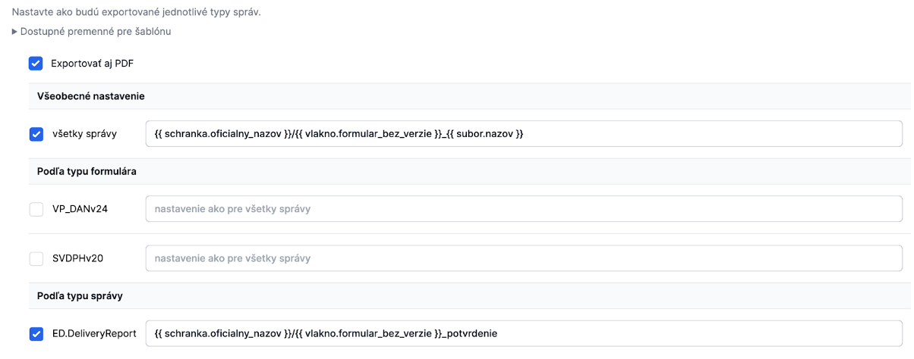

##### Ukážka výslednej štruktúry dokumentov
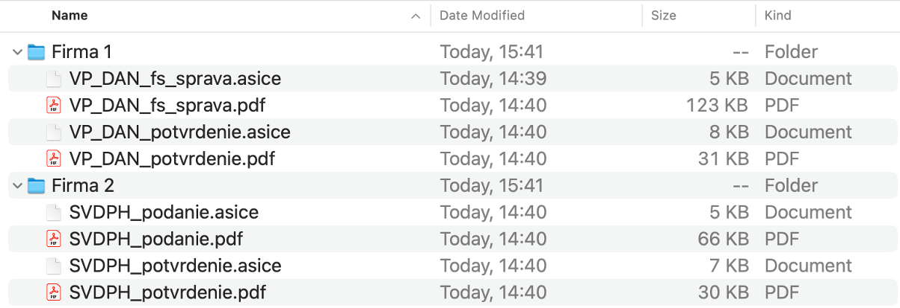

#### Príklad 2 FS agenda

Export podaní s originál názvom súboru a export potvrdení so špeciálnym pomenovaním, ak požadujete, aby:

* dokumenty boli uložené v priečinku s názvom daného subjektu, kt. sa týka,
* v priečinku daného subjektu boli podania zatriedené do ďalších priečinkov podľa obdobia podania,
* v názve každého súboru bolo uvedené, o aký typ podania sa jedná,
* odoslané podania boli uložené s originál názvom súboru,
* potvrdenia boli pomenované ako potvrdenia.

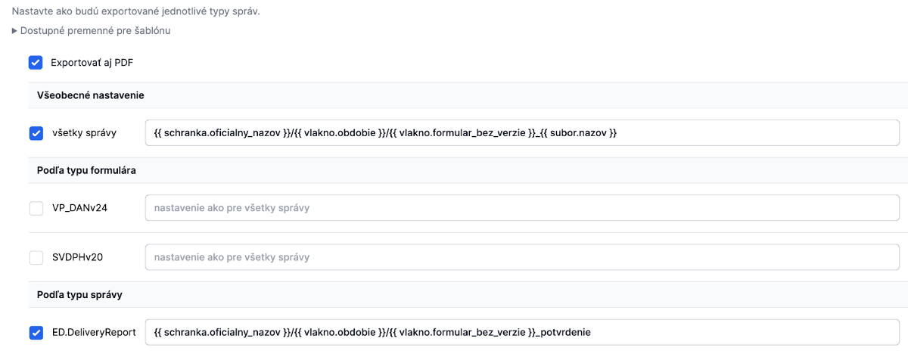

##### Ukážka výslednej štruktúry dokumentov
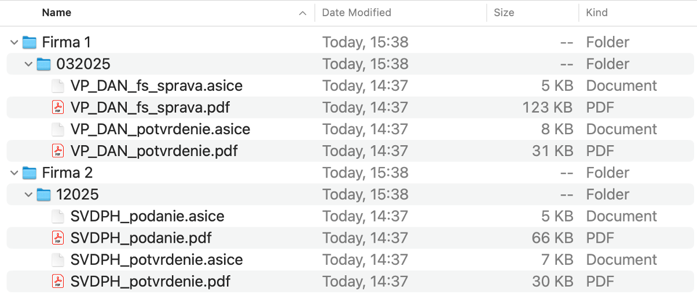

#### Príklad 3 FS agenda

Export iba potvrdení (bez odoslaných podaní).   
Pozn.: označenie pre potvrdenia z FS je ED.DeliveryReport.  
Ak požadujete, aby:

* dokumenty boli uložené v priečinku s názvom daného subjektu, kt. sa týka,
* v názve každého súboru bolo uvedené, o aký typ podania sa jedná,
* potvrdenia boli pomenované ako potvrdenia.

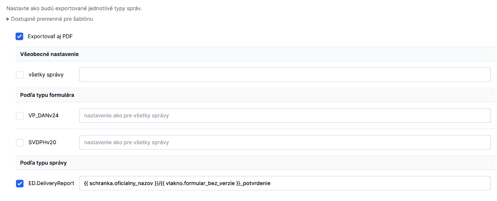

##### Ukážka výslednej štruktúry dokumentov
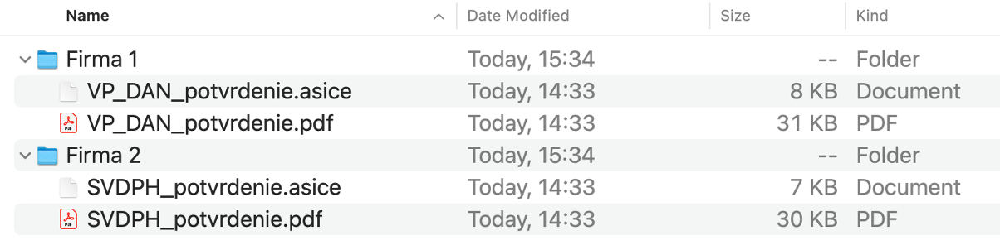

##### 

#### Príklad 4 FS agenda

Export podaní a potvrdení so špeciálnym pomenovaním, ak požadujete, aby:

* dokumenty boli uložené v jednom priečinku,
* v názve každého súboru bolo uvedené, o aký typ podania sa jedná, za aké obdobie a názov daného subjektu,
* potvrdenia obsahovali navyše v názve prijatie.

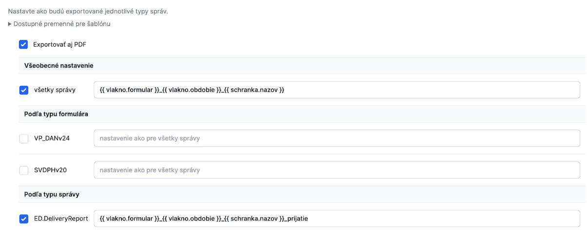

##### Ukážka výslednej štruktúry dokumentov
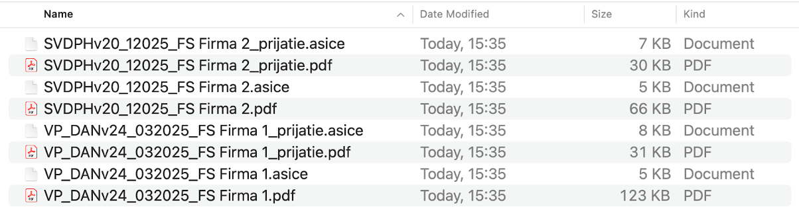

#### Príklad 5 slovensko-sk agenda

Export iba odoslaných podaní spolu s prílohami. Pozn.: označenie pre podania je `EGOV_APPLICATION`.  
Ak požadujete, aby:

* dokumenty boli uložené v priečinku s názvom daného subjektu, kt. sa týka,
* v priečinku daného subjektu boli podania zatriedené do ďalších priečinkov podľa dátumu doručenia,
* odoslané podania boli uložené s pôvodným názvom.

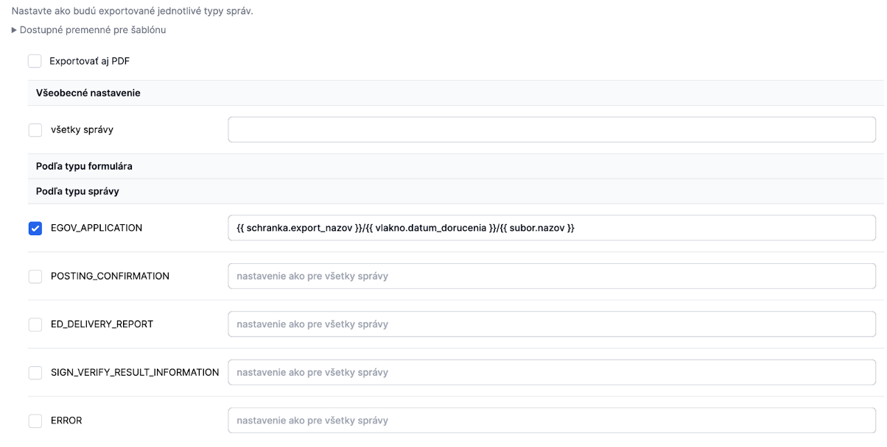

##### Ukážka výslednej štruktúry dokumentov
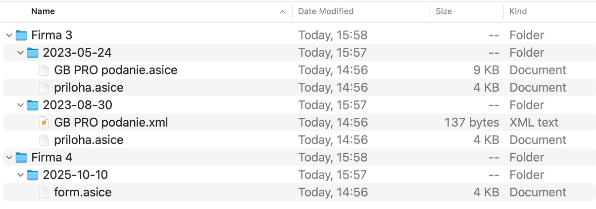