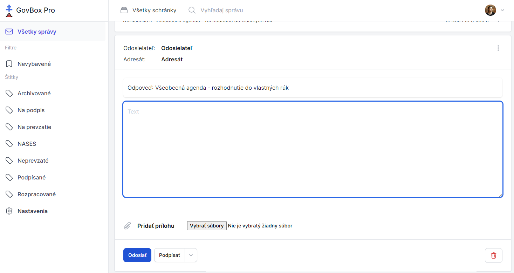

# Odpovedanie na správy

Po zobrazení obsahu vlákna sa v prípadoch, kedy typ správy umožňuje odpoveď, zobrazuje tlačidlo **"Odpovedať"**.

## Formulár odpovede

Po kliknutí na tlačidlo **"Odpovedať"** sa zobrazí nové pole na odpoveď:

### Štruktúra formulára
1. **Odosielateľ/Adresát** - automaticky vyplnené
2. **Predmet** - automaticky vyplnené s názvom správy, na ktorú odpovedáte
3. **Textové pole** - pre zadanie textu odpovede
4. **Tlačidlo "Podpísať"** a/alebo **"Vyžiadať na podpis"**
5. **Tlačidlo "Pridať prílohu"**
6. **Tlačidlo "Odoslať"**

::: callout info "Podpisovanie"
Pred odoslaním odpovede môžete dokument podpísať elektronicky pomocou Autogramu alebo vyžiadať podpis od iného používateľa.
:::

### Podpisovanie dokumentov
Elektronický podpis priamo v schránke pomocou Autogramu.

- **[Podpis dokumentu](/signing/sign-document)**

### Vyžiadanie podpisu
Vyžiadanie podpisu od iného používateľa.

- **[Vyžiadanie podpisu](/signing/request-signature)**

### Prílohy
Pridávanie príloh k odpovedi.

- **[Zobrazenie príloh](/attachments/viewing)**

