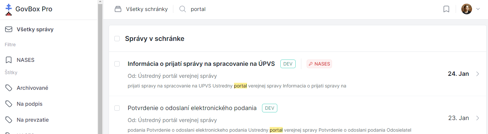

# Vyhľadávanie správ a vlákien

V hornej časti obrazovky sa nachádza pole vyhľadávania.

## Základné vyhľadávanie

1. **Zadajte kľúčové slovo**
   Do poľa vyhľadávania zadajte aspoň jedno kľúčové slovo

2. **Odošlite vyhľadávanie**
   Stlačte Enter alebo kliknite na tlačidlo hľadania

3. **Zobrazia sa výsledky**
   Zobrazia sa vlákna, ktoré vyhľadávaniu vyhovujú



## Pokročilé vyhľadávanie

::: callout info
Pre pokročilé vyhľadávanie je možné použiť nasledovné operátory, ktoré je možné ľubovoľne kombinovať aj s kľúčovými slovami:
:::

| Operátor | Popis | Príklad |
|----------|-------|---------|
| `label:(Názov)` | Vyhľadanie vlákien so štítkom | `label:(Test)` |
| `-label:(Názov)` | Vyhľadanie vlákien bez štítku | `-label:(Test)` |
| `-label:(*)` | Vyhľadanie vlákien úplne bez štítkov | `-label:(*)` |

## Príklady vyhľadávania

### Časté vyhľadávania
**Všetky správy od daňového úradu:**
```
Daňový úrad
```

**Správy so štítkom "Financie":**
```
label:(Financie)
```

**Nevybavené správy (bez štítku "Vybavené"):**
```
-label:(Vybavené)
```

::: callout tip "Tip"
Vytvorte si **filter** pre často používané vyhľadávania - ušetríte čas pri opakovanom vyhľadávaní.
:::
