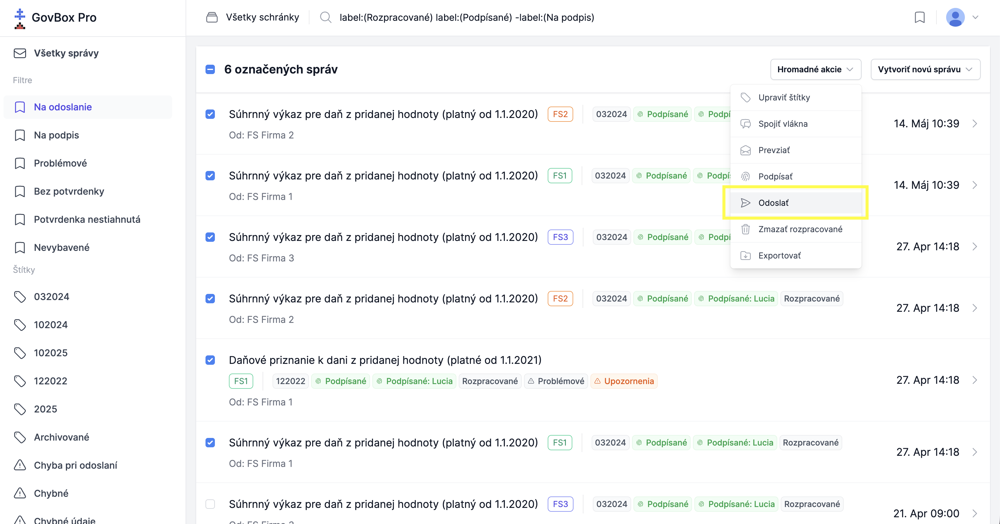

# Odoslanie správ

Po zobrazení obsahu vlákna sa pri rozpracovaných správach zobrazuje tlačidlo **"Odoslať"**.

::: callout info
Správy je možné odoslať jednotlivo alebo hromadne.
:::

## Odoslanie jednej správy

1. **Otvorte vlákno**
   Používateľ otvorí vlákno s rozpracovanou správou pripravenou na odoslanie

2. **Kliknite na odoslanie**
   Klikne na tlačidlo **"Odoslať"**

3. **Počkajte na spracovanie**
   Na obrazovke sa zobrazí oznam **"Správa bola zaradená na odoslanie"**

4. **Obnovte stránku**
   O niekoľko sekúnd bude stav správy zmenený na "Správa bola odoslaná", resp. rozpracovaná správa bude nahradená odoslanou správou zo schránky

::: callout warning "Upozornenie"
Správy sa nezmenia z rozpracovaných na odoslané okamžite, ale zmeny budú viditeľné po opätovnom načítaní stránky v prehliadači alebo po pár sekundách.
:::

## Hromadné odoslanie správ

1. **Otvorte správy na odoslanie**
   Používateľ otvorí zoznam správ, ktoré chce odoslať, buď cez tlačidlo "Všetky správy" alebo cez niektorý z filtrov, resp. štítkov

2. **Označte správy**
   Zaškrtnutím označí správy, ktoré chce odoslať

3. **Vyberte hromadnú akciu**
   Klikne na tlačidlo **"Hromadné akcie"** a zvolí možnosť **"Odoslať"**

   

4. **Potvrďte odoslanie**
   Potvrdí, že naozaj chce odoslať správy

5. **Počkajte na spracovanie**
   Na obrazovke sa zobrazí oznam **"Správy vo vláknach boli zaradené na odoslanie"**
