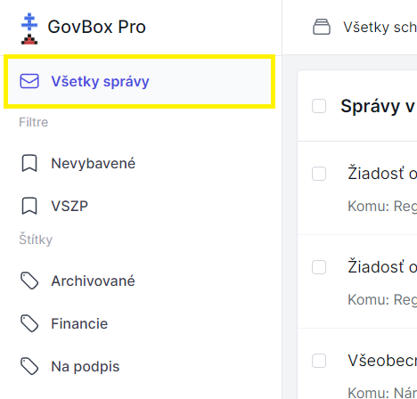

# Zobrazenie všetkých správ

Používateľ môže mať prístup do viacerých schránok. GovBox Pro umožňuje prepínanie medzi jednotlivými schránkami alebo zobrazenie všetkých správ.

## Zobrazenie správ

Po prihlásení do GovBox Pro si používateľ má možnosť zobraziť všetky vlákna, ktoré sa v schránke nachádzajú.

1. **Kliknite na "Všetky správy"**
   Kliknite na **"Všetky správy"** v ľavom hornom rohu obrazovky

2. **Zobrazia sa vlákna**
   Po kliknutí sa zobrazia všetky vlákna

3. **Otvorenie vlákna**
   Kliknutím na konkrétne vlákno ho otvoríte

### Zobrazenie zbalenej správy

1. **Nájdite zbalenú správu**
   Niektoré správy (nepodstatné) môžu byť automaticky zbalené

2. **Zobrazte celý obsah**
   Kliknite na ikonu šípky nadol
   Zobrazí sa celý obsah správy

::: callout tip "Tip"
Zbalené správy sú zvyčajne automaticky označené ako menej dôležité. Ak ich potrebujete vidieť, stačí kliknúť na šípku.
:::

## Prepojenie správ so schránkami

::: callout info
Každá správa má označenú príslušnosť k schránke, takže vždy viete, z ktorej schránky správa pochádza.
:::

### Prepínanie schránok
Ak máte prístup k viacerým schránkam, môžete:
- Zobraziť správy z konkrétnej schránky
- Zobraziť všetky správy z všetkých schránok
- Jednoducho prepínať medzi schránkami pomocou rozbaľovacieho menu

## Súvisiace témy

### Zobrazenie vlákna
Ako otvoriť a čítať konkrétne vlákno.

- **[Zobrazenie vlákna](/messages/viewing-thread)**

