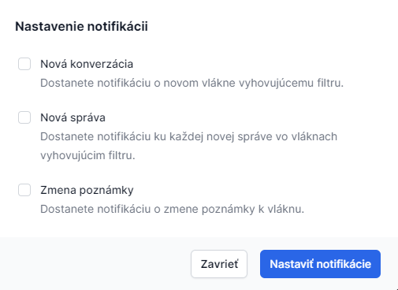

# Nastavenie notifikácií

Notifikácie sú upozornením na aktivitu v schránke. GovBox Pro ponúka možnosti nastavenia notifikácií upozorňujúcich na nové správy, zmeny vlákna či štítku.

::: callout info "Predpoklady"
Notifikácie je možné nastaviť na udalosti týkajúce sa správ a vlákien, ktoré spĺňajú podmienky už vytvoreného filtra.
:::

## Postup nastavenia notifikácie

1. **Zvoľte filter**
   Používateľ zvolí v ľavom menu žiadaný filter

2. **Otvorte nastavenia notifikácií**
   Kliknutím na ikonu zvončeka sa otvorí okno s možnosťami nastavenia notifikácií

3. **Zvoľte udalosti**
   Používateľ zvolí, na aké udalosti chce byť notifikovaný

4. **Uložte nastavenia**
   Klikne na tlačidlo **"Nastaviť notifikácie"**

::: callout warning "Dôležité"
Notifikácie sa budú týkať iba správ, ktoré spĺňajú podmienky vybraného filtra.
:::

## Prístup k notifikáciám

### Kde nájsť notifikácie
Notifikácie sú k dispozícii po kliknutí na ikonu používateľa v pravom hornom menu a voľbe **"Notifikácie"**.

## Súvisiace témy

### Filtre
Vytvorte filter pre správy, na ktoré chcete dostávať notifikácie.

- **[Vytvorenie filtra](/filters/creating)**

### Notifikácia (pojem)
Čo je notifikácia a aké typy existujú.

- **[Notifikácia (pojem)](/concepts/notification)**

