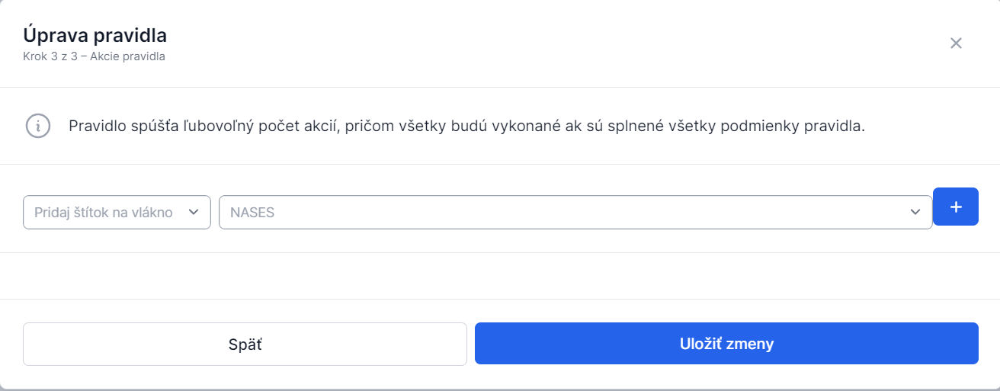

# Vytvorenie pravidla

Pravidlo je skupina podmienok a akcií, ktoré sa majú vykonať pri nejakej udalosti v schránke.

::: callout info "Praktický príklad"
> **Vytvorím štítok "Financie", pre ktorý definujem pravidlo označovania pre správy prichádzajúce od poisťovní, Úradu Práce, sociálnych vecí a rodiny, Daňového úradu a správy.**
:::

## Postup vytvorenia pravidla

1. **Otvorte pravidlá**
   Administrátor klikne na **"Pravidlá"** v Nastaveniach v ľavom menu

2. **Zobrazte zoznam pravidiel**
   V okne sú zobrazené vytvorené pravidlá

3. **Vytvorte nové pravidlo**
   Nové pravidlo je možné vytvoriť kliknutím na **"Vytvoriť pravidlo"** v pravom hornom rohu

4. **Nastavte základné údaje**
   Administrátor je vyzvaný na nastavenie:
   - **Názov pravidla**
   - **Udalosť spúšťajúca pravidlo**
   
   Uloženie zadaných údajov sa vykoná kliknutím na **"Pokračovať"**

5. **Zadajte podmienky**
   Administrátor je vyzvaný na zadanie **podmienok pre pravidlo**
   - Podmienok môže byť ľubovoľný počet
   - Uloženie zadaných údajov sa vykoná kliknutím na ikonu Plus a následne **"Pokračovať"**

6. **Zadajte akcie**
   Administrátor je vyzvaný na zadanie **akcií pravidla**
   - Uloženie zadaných údajov sa vykoná kliknutím na ikonu Plus a následne **"Uložiť zmeny"**

### Zoznam pravidiel

### Nastavenie pravidla

### Podmienky pravidla

### Akcie pravidla

