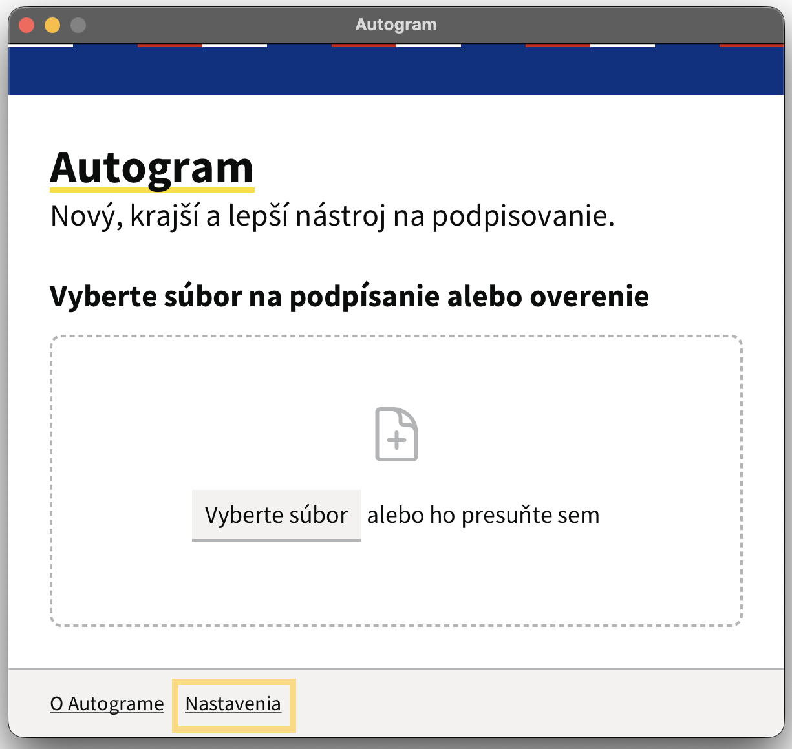
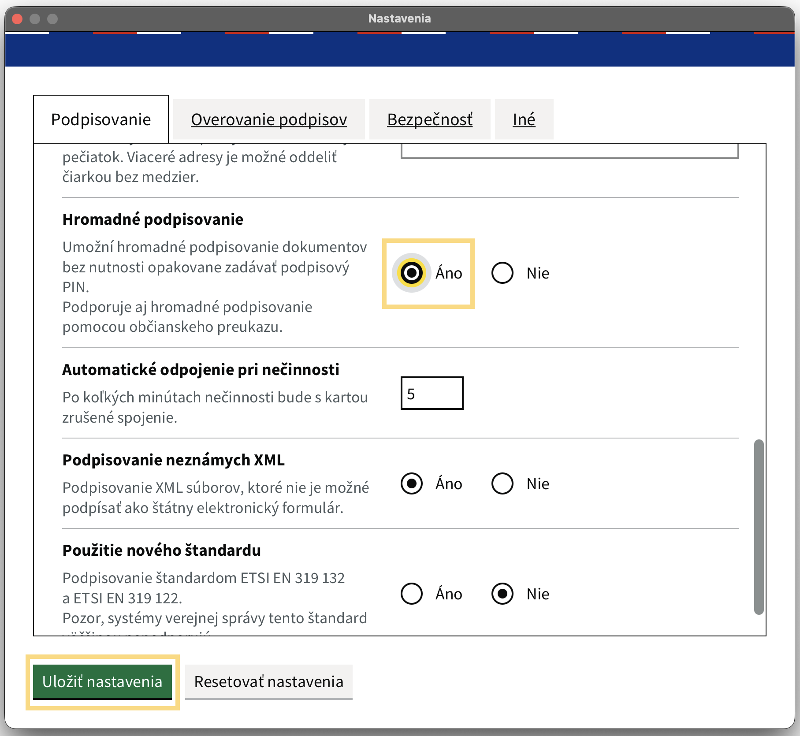

# Hromadné podpisovanie dokumentov

::: callout warning "Predpoklady"
Aby používateľ mohol čokoľvek podpisovať, musí byť súčasťou skupiny **"Podpisovatelia" a mať [Autogram](https://sluzby.slovensko.digital/autogram/) nainštalovaný**.
:::

## Postup hromadného podpisu

1. **Označte vlákna na podpis**
   Používateľ si zvolí štítok **"Na podpis: [meno používateľa]"** a v prehľade vlákien označí správy, ktoré chce podpísať

2. **Vyberte hromadnú akciu**
   Klikne na tlačidlo **"Hromadné akcie"** a zvolí možnosť **"Podpísať"**

3. **Spustite podpisovanie**
   Klikne na tlačidlo **"Podpísať Autogramom"**

4. **Podpíšte dokumenty**
   Podpíše dokumenty Autogramom, pričom počas podpisovania je potrebné nezatvárať kartu prehliadača

## Hromadný podpis na 1xPIN v Autograme

Aby ste nemuseli zadávať podpisový PIN k vašej karte pre každý dokument, zapnite v Autograme možnosť hromadného podpisovania.

1. Na hlavnej obrazovke **Autogramu** kliknite na **"Nastavenia"**

2. Hneď v prvej záložke **"Podpisovanie"** sa posuňte trochu nižšie a zapnite **"Hromadné podpisovanie"**. Následne uložte nastavenia.

## Výsledok podpisu

### Po úspešnom podpísaní
- Používateľ je informovaný správou **"Dokumenty boli úspešne podpísané"**
- Pri jednotlivých vláknach a dokumentoch sa zobrazí zelený štítok **"Podpísané"**

::: callout success "Hotovo!"
Hromadné podpisovanie umožňuje efektívne podpísať viacero dokumentov naraz.
:::
