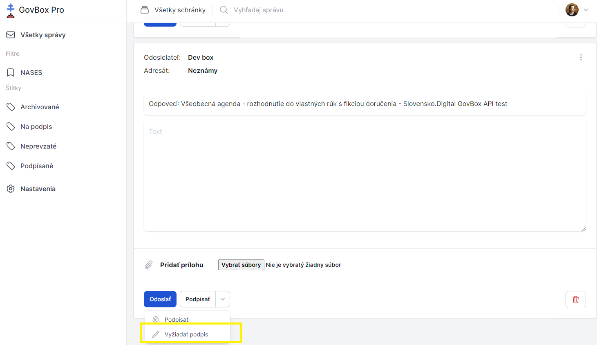

# Vyžiadanie podpisu od iného používateľa

Používateľ môže vyžiadať podpis od iných používateľov, typicky napríklad od konateľa spoločnosti. Tento používateľ následne vidí dokumenty potrebné na podpísanie.

## Postup vyžiadania podpisu

1. **Zvoľte spôsob podpisu**
   Pod obsahom správy má používateľ na výber tlačidlo rozbalovacie **"Podpísať"** alebo priamo **"Vyžiadať na podpis"**

2. **Vyberte dokumenty**
   Po kliknutí na **"Vyžiadať na podpis"** používateľ zvolí, ktoré dokumenty je potrebné podpísať

3. **Zvoľte podpisujúcich**
   Používateľ vyberie osoby, ktoré majú dokumenty podpísať

4. **Uložte zmeny**
   Uloží zmeny

5. **Označenie správy**
   Správa bude označená štítkom **"Na podpis: [meno používateľa]"**

::: callout info "Informácia pre podpisovateľa"
Používateľ, ktorému bol podpis vyžiadaný, uvidí dokumenty potrebné na podpísanie po prihlásení do GovBox PRO.
:::
