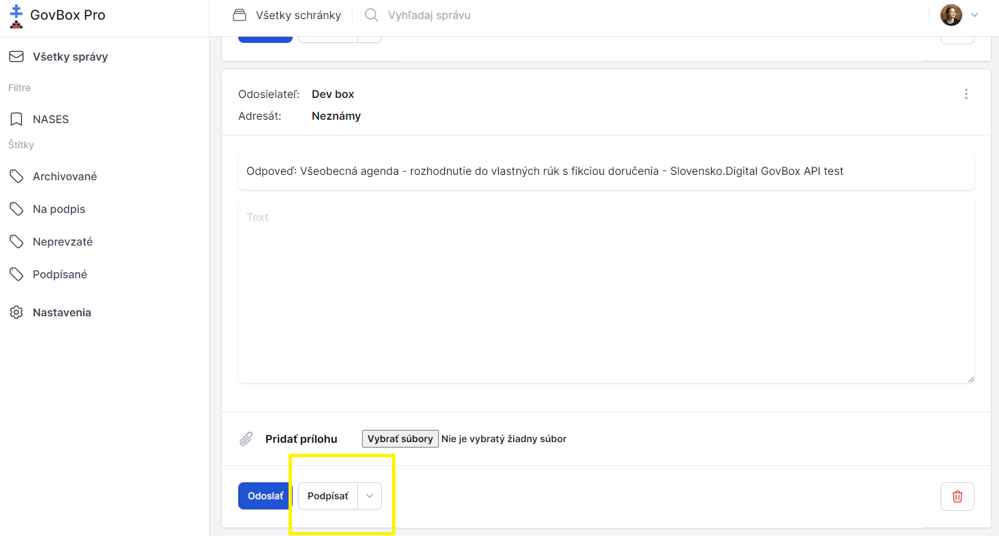
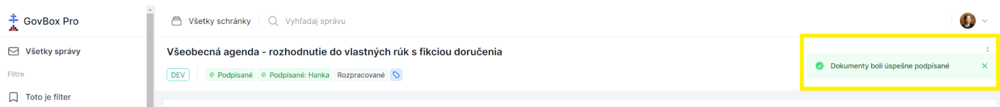
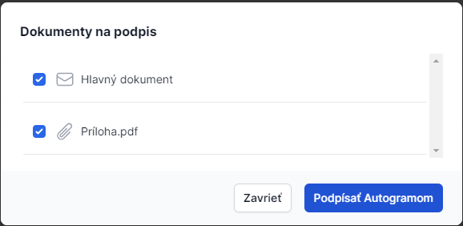

# Podpis dokumentu alebo prílohy

Elektronický podpis dokumentu či prílohy je možné zrealizovať priamo v schránke pomocou integrovaného podpisovača Autogram.

::: callout warning "Predpoklady"
Aby používateľ mohol čokoľvek podpisovať, musí byť súčasťou skupiny **"Podpisovatelia"**.
:::

## Postup podpisu dokumentu

1. **Otvorte správu**
   Používateľ otvorí správu a pod obsahom klikne na tlačidlo **"Podpísať"**

2. **Zvoľte súbory na podpis**
   Používateľ zvolí súbory, ktoré chce podpísať (ak správa obsahuje aj prílohy)

3. **Spustite podpisovanie**
   Klikne na tlačidlo **"Podpísať Autogramom"**

4. **Podpíšte dokumenty**
   Podpíše súbory, pričom počas podpisovania nezatvára okno prehliadača

5. **Overte úspech**
   Po úspešnom podpísaní je používateľ informovaný správou **"Dokumenty boli úspešne podpísané"**
   Pri jednotlivých dokumentoch sa zobrazí štítok **"Podpísané"**, prípadne vo formáte **"Podpísané: meno podpisovateľa"**, ak správa vyžaduje viacero podpisov

### Tlačidlo podpísať

### Dialóg Autogram

### Podpísané dokumenty

## Súvisiace témy

### Vyžiadanie podpisu
Vyžiadajte podpis od iného používateľa.

- **[Vyžiadanie podpisu](/signing/request-signature)**

### Hromadné podpisovanie
Podpište viacero dokumentov naraz.

- **[Hromadné podpisovanie](/signing/bulk-signing)**

