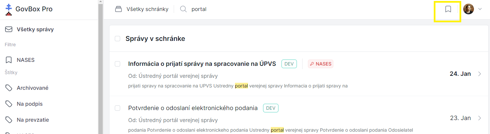
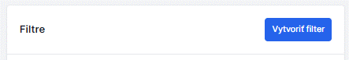
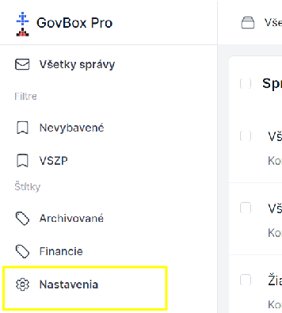

# Vytvorenie vlastného filtra

Filter je dopyt vyhľadávania uložený spoločne s názvom na neskoršie využitie.

## Príklad použitia

> **Vytvorím filter "Nevybavené", kde sa budem dopytovať na všetky správy, ktoré nemajú štítok "Vybavené". Zobrazenie tohto filtra zabezpečí prehľad agendy, ktorá vyžaduje riešenie či odpoveď.**
> 
> Dopyt: `-label:(Vybavené)`

## Spôsob vytvorenia filtra

### Spôsob 1: Z poľa vyhľadávania

1. Filter nastavíte priamo po zadaní dopytu do poľa vo vrchnej časti obrazovky
2. Po vyhľadaní správ máte k dispozícii v pravej časti obrazovky ikonu filtra
3. Kliknutím na ikonu filtra ponúka možnosť uloženia dopytu vo forme filtra

4. V pravom hornom rohu sa nachádza modré tlačidlo **"Vytvoriť filter"**
5. Po kliknutí sa zobrazí nové okno s názvom **"Nový filter"**

6. V okne nový filter sa nachádzajú:
   - Pole pre **názov** filtra
   - Pole pre **dopyt** na vyhľadávanie
   - Tlačidlo **"Zahodiť"**
   - Tlačidlo **"Vytvoriť"**

7. Dopyt na negáciu môžete zadať použitím **mínus** (napr. `-label:(Vybavené)`)

### Spôsob 2: Z bočného menu

1. V ľavom bočnom menu sa nachádzajú filtre, štítky a ikona pre nastavenie
2. Kliknite na nastavenie
3. Zobrazí sa okno s názvom **"Filtre"**
4. V pravom rohu kliknite na **"Vytvoriť filter"**
5. Zadajte názov a dopyt na vyhľadávanie

## Operátory pre vyhľadávanie

| Operátor | Popis | Príklad |
|----------|-------|---------|
| `label:(Názov)` | Vyhľadanie vlákien so štítkom | `label:(Test)` |
| `-label:(Názov)` | Vyhľadanie vlákien bez štítku | `-label:(Test)` |
| `-label:(*)` | Vyhľadanie vlákien úplne bez štítkov | `-label:(*)` |

## Súvisiace témy

- [Nastavenie notifikácií](../notifications/setting-up.md)
- [Filter (pojem)](../concepts/filter.md)
