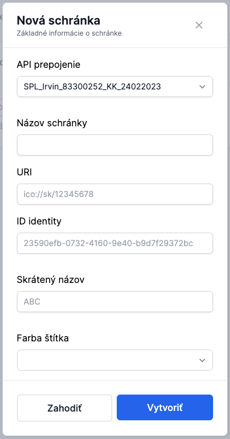

# Správa schránok

Administrátor môže do aplikácie pridať ďalšie elektronické schránky.

## Predpoklady

Pridať je možné iba také schránky, na ktoré má tenant oprávnenie na zastupovanie.

## Zistenie oprávnení na slovensko.sk

1. Prihláste sa do el. schránky tenanta cez slovensko.sk
2. Prejdite na [zoznam identít, ktoré je tenant oprávnený zastupovať](https://www.slovensko.sk/sk/moj-profil/zobrazenie-zastupovania)
   - Kliknite na uvedený link, alebo
   - Po prihlásení prejdite do sekcie **"Profil"** a následne do sekcie **"Zobrazenie zastupovania"**
3. Podľa sekcie **"Ste oprávnený zastupovať nasledovné identity"** zistíte, ktoré schránky môžete pridať

## Postup pridania schránky v GovBox PRO

1. Administrátor klikne v ľavom bočnom menu na **"Nastavenia"**
2. V sekcii **"Administrácia"**, klikne na možnosť **"Schránky"**
3. Administrátor klikne na tlačidlo **"Pripojiť novú schránku"** vpravo hore
4. Vyplní údaje o el. schránke:
   - **Názov** el. schránky
   - **URI** - skopírujte z [zoznamu](https://www.slovensko.sk/sk/moj-profil/zobrazenie-zastupovania) na portáli slovensko.sk
   - **ID identity** - skopírujte z [zoznamu](https://www.slovensko.sk/sk/moj-profil/zobrazenie-zastupovania) na portáli slovensko.sk
   - **Skrátený názov** schránky
   - **Farba štítka** pre danú schránku
5. Administrátor klikne na tlačidlo **"Vytvoriť"**

## Poznámka

Ak by ste v časti **"Nastavenia"** → **"Schránky"** nevideli tlačidlo **"Pripojiť novú schránku"**, je potrebné nastaviť iný typ pripojenia schránok. V takom prípade kontaktujte administrátora.
