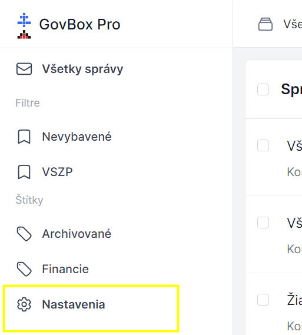
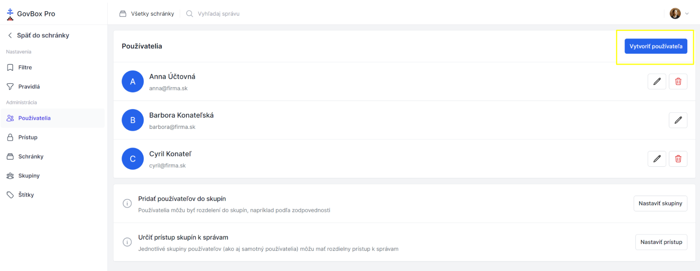
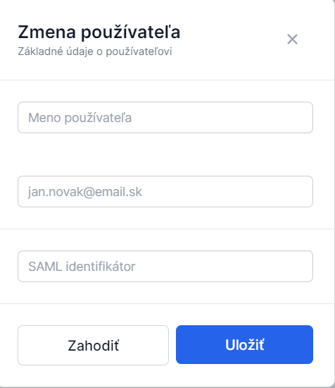

# Správa používateľov

Administrátor môže udeliť prístup do aplikácie ďalším používateľom.

## Postup pridania používateľa

1. Administrátor klikne v ľavom bočnom menu na **"Nastavenia"**
2. V sekcii **"Administrácia"**, klikne na možnosť **"Používatelia"**
3. Administrátor klikne na tlačidlo **"Vytvoriť používateľa"** v pravom hornom rohu
4. Vyplní základné údaje o používateľovi

## SAML identifikátor

SAML identifikátor slúži na prihlasovanie cez slovensko.sk a **nie je povinný**.

## Prístup k správam

Novému používateľovi je možné udeliť plný alebo čiastočný prístup k správam. Ku ktorým správam bude mať používateľ prístup je možné ovplyvniť pomocou:
- **Štítkov**
- **Skupín**

Podľa potreby administrátor priradí nového používateľa do skupín.

## Súvisiace témy

- [Skupiny](./group-management.md)
- [Štítky](../labels/creating.md)
- [Prístup k štítkom](../labels/access-control.md)
