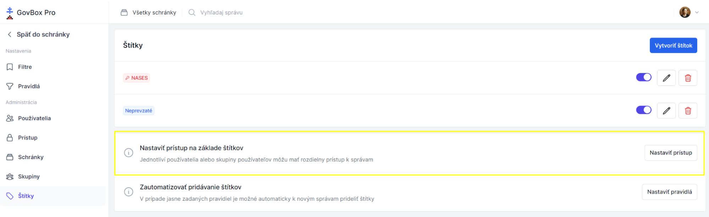

# Prístup k štítkom

Prístup k štítkom umožňuje administrátorom kontrolovať, ktorí používatelia alebo skupiny majú prístup k vláknam označeným konkrétnym štítkom.

## Postup nastavenia prístupu

1. Kliknite na **"Nastavenia"** v ľavom menu dole
2. V sekcii **"Administrácia"** kliknite na možnosť **"Štítky"**
3. Zobrazí sa prehľad vytvorených štítkov a sekcia **"Nastaviť prístup na základe štítkov"**

4. Kliknite na **"Nastaviť prístup"** v príslušnom riadku
5. V nastaveniach sa riadi príslušnosť k skupinám
6. Kliknutím na ikonu pera v danom riadku skupiny, ktorej je potrebné nastaviť prístup, má administrátor možnosť skupine prideliť alebo odobrať prístup k štítku

## Príklady použitia

### Príklad 1: Sociálna poisťovňa
> Vytvorím štítok **"Sociálna poisťovňa"** s pravidlom, že správy prichádzajúce a odchádzajúce do Sociálnej poisťovne budú takto označované. Ekonomickému oddeleniu vo firme udelím prístup na zobrazenie správ s týmto štítkom. Iné správy osobám s týmto oprávnením zobrazené nebudú.

### Príklad 2: Prístup k financiám
> Ekonomickému oddeleniu udelím prístup k správam so štítkom **"Financie"**.

## Súvisiace témy

- [Vytvorenie štítka](./creating.md)
- [Správa skupín](../getting-started/group-management.md)
- [Štítok (pojem)](../concepts/label.md)
