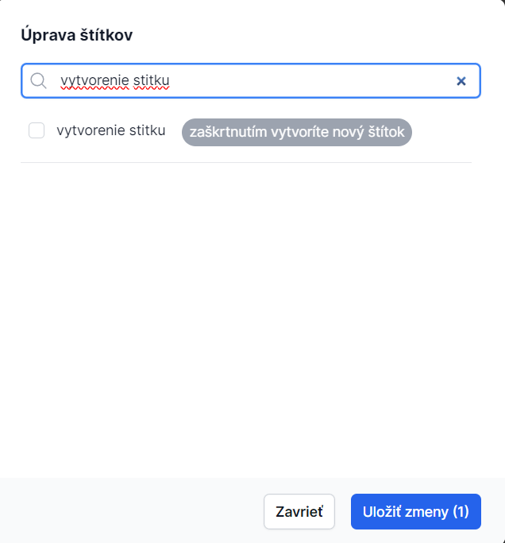

# Vytvorenie štítka a označenie vlákna

## Príklad použitia

> **Vytvorím štítok "Vybavené". Týmto štítkom budem označovať vlákna, ktoré už sú vybavené a nevyžadujú ďalej moju pozornosť.**

## Postup vytvorenia štítka

1. Kliknite na konkrétne vlákno pre zobrazenie jeho obsahu
2. Pod názvom vlákna sa nachádza modrá ikona pre priradenie štítku

3. Kliknite na modrú ikonu
4. Zobrazí sa okno s názvom **"Úprava štítkov"**
5. Napíšte názov nového štítku do poľa
6. Zaškrtnutím poľa potvrďte jeho vytvorenie

7. Označte vlákno ľubovoľným štítkom
8. Kliknite na **"Uložiť zmeny"**

9. Po týchto krokoch sa vybraný štítok zobrazí pri konkrétnom vlákne

## Súvisiace témy

- [Úprava štítka](./editing.md)
- [Prístup k štítkom](./access-control.md)
- [Štítok (pojem)](../concepts/label.md)
