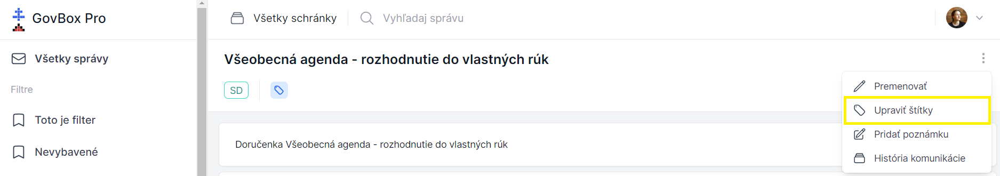

# Úprava štítkov

## Postup úpravy štítkov

1. Pri zobrazení konkrétneho vlákna sa v pravom hornom rohu nachádza ikona s troma bodkami
2. Kliknite na ikonu s troma bodkami
3. V rozbaľovacom menu vyberte možnosť **"Upraviť štítky"**

4. Zobrazí sa nové okno pre úpravu štítkov, kde je možné:
   - **Označiť** štítky pre pridanie k vláknu
   - **Odznačiť** štítky pre odobratie z vlákna
   - **Vyhľadať** štítok

5. Kliknite na modré tlačidlo **"Uložiť zmeny"**
6. V pravom hornom rohu obrazovky sa objaví zelené okno s informáciou o úspešnom pridaní/odobratí štítku
7. Zmeny sa prejavia aj pod názvom vlákna v sekcii **"Štítky"**

## Súvisiace témy

- [Vytvorenie štítka](./creating.md)
- [Prístup k štítkom](./access-control.md)
