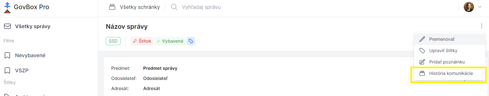

# História komunikácie vlákna

Pri zobrazení konkrétnej správy sa pri názve správy v pravom rohu nachádza ikona s troma bodkami.

## Zobrazenie histórie komunikácie

1. Kliknite na ikonu s troma bodkami pri názve správy
2. V rozbaľovacom menu vyberte možnosť **"História komunikácie"**

3. Po kliknutí sa pod názvom vlákna zobrazí nové okno s históriou komunikácie

## Využitie histórie komunikácie

História komunikácie umožňuje:
- Prehľad všetkých správ v rámci vlákna
- Sledovanie chronologického priebehu komunikácie
- Orientáciu v dlhších vláknach
