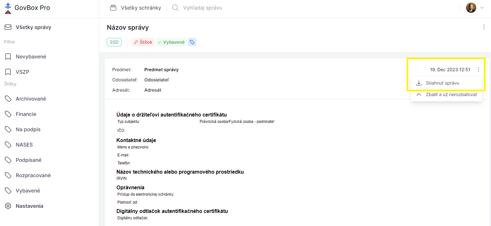
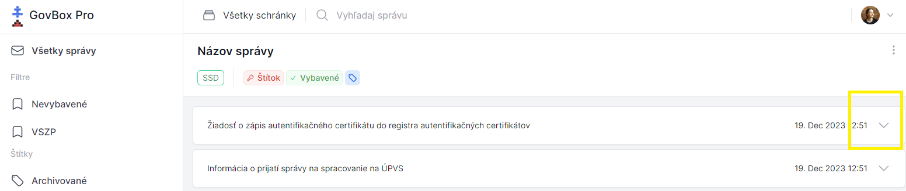

# Stiahnutie správy

Pri zobrazení konkrétnej správy sa pri predmete v pravom rohu nachádza ikona s troma bodkami.

## Postup stiahnutia

1. Kliknite na ikonu s troma bodkami pri predmete správy
2. V rozbaľovacom menu vyberte možnosť stiahnutia správy

> **Poznámka:** Takto stiahnutá správa je určená skôr pre technikov pre účely analýzy chýb ako bežných používateľov.

## Zobrazenie zbalenej správy

Niektoré správy (nepodstatné) môžu byť automaticky zbalené. Pre opätovné zobrazenie celého obsahu správy:

1. Kliknite na ikonu šípky nadol
2. Zobrazí sa celý obsah správy

