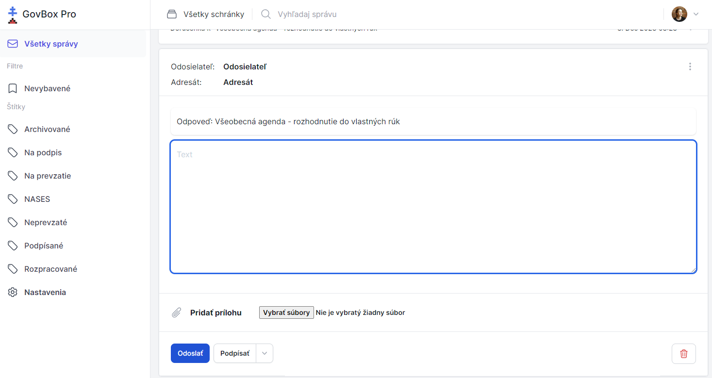

# Odpovedanie na správy

Po zobrazení obsahu vlákna sa v prípadoch, kedy typ správy umožňuje odpoveď, zobrazuje tlačidlo **"Odpovedať"**.

## Formulár odpovede

Po kliknutí na tlačidlo **"Odpovedať"** sa zobrazí nové pole na odpoveď, ktorá sa skladá z:

1. **Odosielateľ/Adresát** - automaticky vyplnené
2. **Odpovede** - automaticky vyplnené s názvom správy, na ktorú odpovedáte
3. **Textové pole** - pre zadanie textu odpovede
4. **Tlačidlo "Podpísať"** a/alebo **"Vyžiadať na podpis"**
5. **Tlačidlo "Pridať prílohu"**
6. **Tlačidlo "Odoslať"**

## Súvisiace témy

- [Podpisovanie dokumentov](../signing/sign-document.md)
- [Vyžiadanie podpisu](../signing/request-signature.md)
- [Prílohy](../attachments/viewing.md)
