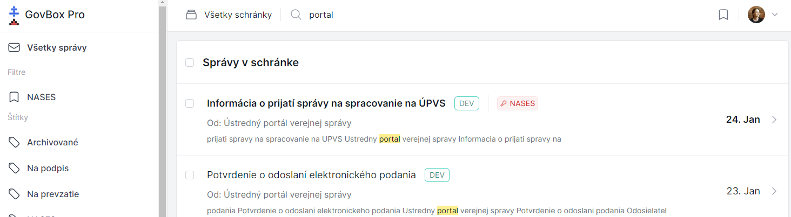

# Vyhľadávanie správ a vlákien

V hornej časti obrazovky sa nachádza pole vyhľadávania.

## Základné vyhľadávanie

Pre vyhľadanie správy stačí zadať aspoň jedno kľúčové slovo, podľa ktorého chce používateľ správu alebo vlákno vyhľadať.

1. Zadajte kľúčové slovo do poľa vyhľadávania
2. Odošlite vyhľadávanie
3. Zobrazia sa vlákna, ktoré vyhľadávaniu vyhovujú

## Pokročilé vyhľadávanie

Pre pokročilé vyhľadávanie je možné použiť nasledovné operátory, ktoré je možné ľubovoľne kombinovať aj s kľúčovými slovami:

| Operátor | Popis | Príklad |
|----------|-------|---------|
| `label:(Názov)` | Vyhľadanie vlákien so štítkom | `label:(Test)` |
| `-label:(Názov)` | Vyhľadanie vlákien bez štítku | `-label:(Test)` |
| `-label:(*)` | Vyhľadanie vlákien úplne bez štítkov | `-label:(*)` |

## Príklady vyhľadávania

- Všetky správy od daňového úradu: `Daňový úrad`
- Správy so štítkom "Financie": `label:(Financie)`
- Nevybavené správy (bez štítku "Vybavené"): `-label:(Vybavené)`
