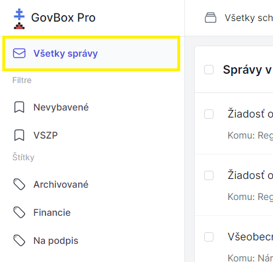

# Zobrazenie všetkých správ

Používateľ môže mať prístup do viacerých schránok. GovBox Pro umožňuje prepínanie medzi jednotlivými schránkami alebo zobrazenie všetkých správ.

## Zobrazenie správ

Po prihlásení do GovBox Pro si používateľ má možnosť zobraziť všetky vlákna, ktoré sa v schránke nachádzajú.

### Postup

1. Kliknite na **"Všetky správy"** v ľavom hornom rohu obrazovky

2. Po kliknutí sa zobrazia všetky vlákna
3. Kliknutím na konkrétne vlákno ho otvoríte

## Prepojenie správ so schránkami

Každá správa má označenú príslušnosť k schránke, takže vždy viete, z ktorej schránky správa pochádza.
