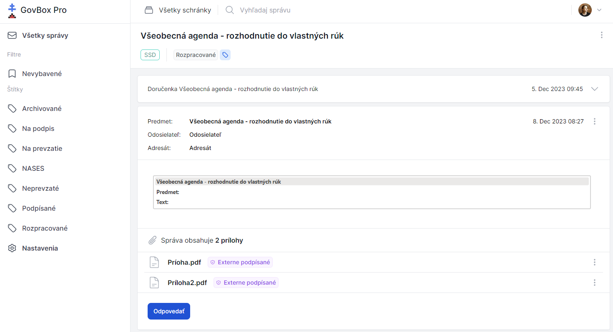

# Zobrazenie konkrétneho vlákna

Po kliknutí na konkrétne vlákno sa zobrazí jeho obsah, ktorý obsahuje jednu alebo viacero správ.

## Zobrazenie správy pozostáva z

1. **Názov** - identifikácia správy
2. **Štítky** - označenie kategórie
3. **Obsah správy** - text správy s možnosťou odpovedať (ak je to možné)
4. **Prílohy** - dokumenty pripojené k správe

## Navigácia vo vlákne

- Kliknutím na šípku nadol zobrazíte zbalenú správu
- Kliknutím na šípku nahor zbalíte správu
- Pomocou ikony s troma bodkami získate prístup k ďalším možnostiam

## Súvisiace témy

- [Odpovedanie na správy](./replying.md)
- [Prílohy](../attachments/viewing.md)
