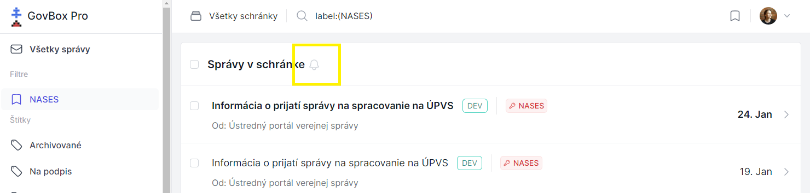
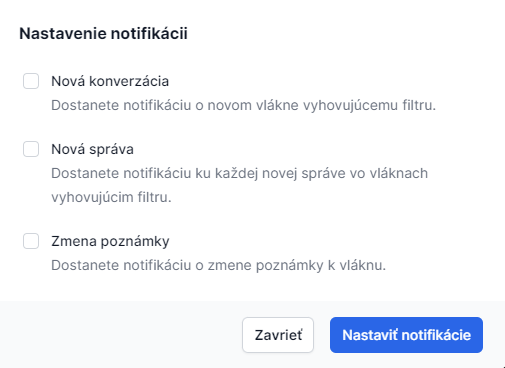

# Nastavenie notifikácií

Notifikácie sú upozornením na aktivitu v schránke. GovBox Pro ponúka možnosti nastavenia notifikácií upozorňujúcich na nové správy, zmeny vlákna či štítku.

## Predpoklady

Notifikácie je možné nastaviť na udalosti týkajúce sa správ a vlákien, ktoré spĺňajú podmienky už vytvoreného filtra.

## Postup nastavenia notifikácie

1. Používateľ zvolí v ľavom menu žiadaný filter
2. Kliknutím na ikonu zvončeka sa otvorí okno s možnosťami nastavenia notifikácií

3. Používateľ zvolí, na aké udalosti chce byť notifikovaný
4. Klikne na tlačidlo **"Nastaviť notifikácie"**

> **Poznámka:** Notifikácie sa budú týkať iba správ, ktoré spĺňajú podmienky vybraného filtra.

## Prístup k notifikáciám

Notifikácie sú k dispozícii po kliknutí na ikonu používateľa v pravom hornom menu a voľbe **"Notifikácie"**.

## Súvisiace témy

- [Filtre](../filters/creating.md)
- [Vytvorenie filtra](../filters/creating.md)
