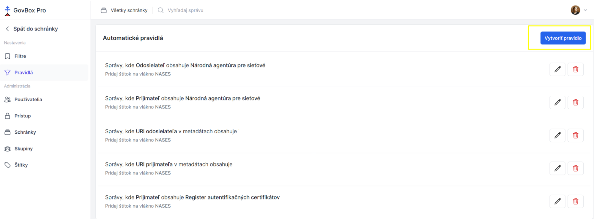

# Vytvorenie pravidla

Pravidlo je skupina podmienok a akcií, ktoré sa majú vykonať pri nejakej udalosti v schránke.

## Postup vytvorenia pravidla

1. Administrátor klikne na **"Pravidlá"** v Nastaveniach v ľavom menu
2. V okne sú zobrazené vytvorené pravidlá
3. Nové pravidlo je možné vytvoriť kliknutím na **"Vytvoriť pravidlo"** v pravom hornom rohu

4. Administrátor je vyzvaný na nastavenie:
   - **Názov pravidla**
   - **Udalosť spúšťajúca pravidlo**
   
   Uloženie zadaných údajov sa vykoná kliknutím na **"Pokračovať"**

5. Administrátor je vyzvaný na zadanie **podmienok pre pravidlo**
   - Podmienok môže byť ľubovoľný počet
   - Uloženie zadaných údajov sa vykoná kliknutím na ikonu Plus a následne **"Pokračovať"**

6. Administrátor je vyzvaný na zadanie **akcií pravidla**
   - Uloženie zadaných údajov sa vykoná kliknutím na ikonu Plus a následne **"Uložiť zmeny"**

## Príklad použitia

> **Vytvorím štítok "Financie", pre ktorý definujem pravidlo označovania pre správy prichádzajúce od poisťovní, Úradu Práce, sociálnych vecí a rodiny, Daňového úradu a správy.**

## Súvisiace témy

- [Štítky](../labels/creating.md)
- [Pravidlo (pojem)](../concepts/rule.md)
