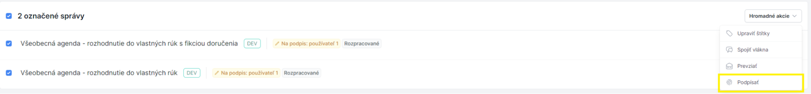

# Hromadné podpisovanie dokumentov

Aby používateľ mohol čokoľvek podpisovať, musí byť súčasťou skupiny **"Podpisovatelia"**.

## Postup hromadného podpisu

1. Používateľ si zvolí štítok **"Na podpis: [meno používateľa]"** a v prehľade vlákien označí správy, ktoré chce podpísať
2. Klikne na tlačidlo **"Hromadné akcie"** a zvolí možnosť **"Podpísať"**
3. Klikne na tlačidlo **"Podpísať Autogramom"**
4. Podpíše dokumenty Autogramom, pričom počas podpisovania je potrebné nezatvárať kartu prehliadača

## Výsledok podpisu

Po úspešnom podpísaní:
- Používateľ je informovaný správou **"Dokumenty boli úspešne podpísané"**
- Pri jednotlivých vláknach a dokumentoch sa zobrazí zelený štítok **"Podpísané"**

## Súvisiace témy

- [Podpis dokumentu](./sign-document.md)
- [Vyžiadanie podpisu](./request-signature.md)
