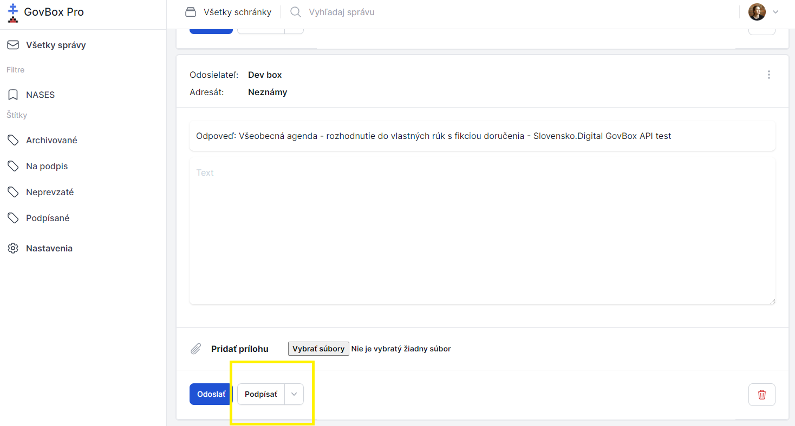
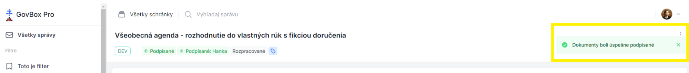
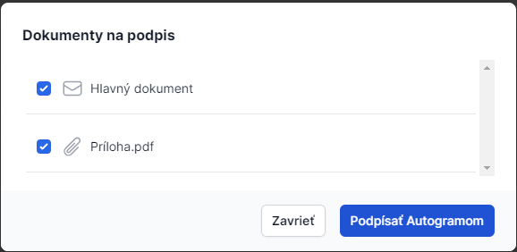

# Podpis dokumentu alebo prílohy

Elektronický podpis dokumentu či prílohy je možné zrealizovať priamo v schránke pomocou integrovaného podpisovača Autogram.

## Predpoklady

Aby používateľ mohol čokoľvek podpisovať, musí byť súčasťou skupiny **"Podpisovatelia"**.

## Postup podpisu dokumentu

1. Používateľ otvorí správu a pod obsahom klikne na tlačidlo **"Podpísať"**
2. Používateľ zvolí súbory, ktoré chce podpísať (ak správa obsahuje aj prílohy)
3. Klikne na tlačidlo **"Podpísať Autogramom"**

4. Používateľ podpíše súbory, pričom počas podpisovania nezatvára okno prehliadača
5. Po úspešnom podpísaní je používateľ informovaný správou **"Dokumenty boli úspešne podpísané"**
6. Pri jednotlivých dokumentoch sa zobrazí štítok **"Podpísané"**, prípadne vo formáte **"Podpísané: meno podpisovateľa"**, ak správa vyžaduje viacero podpisov

## Súvisiace témy

- [Vyžiadanie podpisu](./request-signature.md)
- [Hromadné podpisovanie](./bulk-signing.md)
